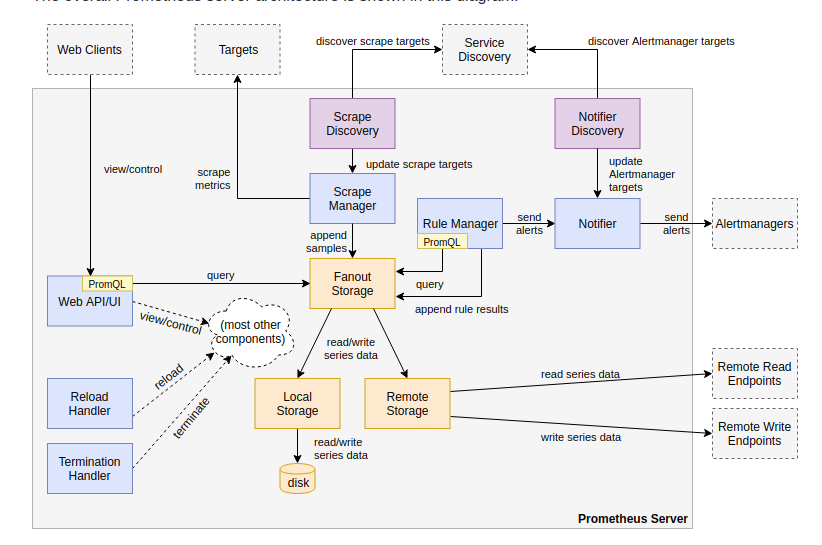

# Prometheus + Grafana

## Tổng quan kiến trúc

## Giám sát một số service

- [Monitoring MySQL/MariaDB](docs/monitor-mysql.md)

- [Monitoring MongoDB](docs/monitoring-mongodb.md)

- [Monitoring Redis](docs/monitoring-redis.md)

- [Monitoring Java Application](docs/monitoring-java-application.md)

- [Monitoring Node.js](docs/monitoring-nodejs)

- [Monitoring network](docs/monitoring-network.md)

...

## Thiết lập cảnh báo

- [Send alert via email & telegram](docs/send-alert-via-email-telegram.md)

## Một số Grafana dashboard đã tùy chỉnh

- [Customize Grafana dashboards](Grafana-dashboards)

## Mẫu cấu hình

Updating ...
