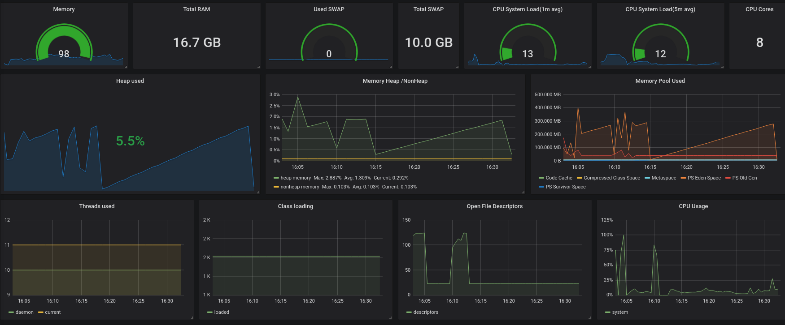

# Monitoring Java Application

Chúng ta có thể sử dụng JMX exporter [https://github.com/prometheus/jmx_exporter](https://github.com/prometheus/jmx_exporter) hoặc thư viện JVM client [https://github.com/prometheus/client_java](https://github.com/prometheus/client_java) để monitor ứng dụng java

Trong phần này, chúng ta sử dụng JMX exporter để cấu hình như java agent cho phép expose các metrics

## Cấu hình JMX Exporter

Tôi thực hiện tạo một sample java application đơn giản ("HelloWorld") cho thực hiện monitor

### Step1: Install JDK

Nếu dùng CentOS, thực hiện cài đặt các gói sau để complile và chạy java

`yum install java-1.8.0-openjdk java-1.8.0-devel -y`

### Step2: Tạo sample java helloworld

- Tạo chương trình HelloWorld

```
mkdir -p ~/java/hello && cd ~/java/hello
cat >~/java/hello/HelloWorld.java<<EOF
public class HelloWorld {
    public static void main(String[] args)
        throws InterruptedException {
            while(true) {
                //Print a message
                System.out.println("Hello World");
                //Pause for 5 seconds
                Thread.sleep(5000);
            }
   }
}
EOF
```

- Compile class file

`javac HelloWorld.java`

- Create jar file

`jar cvfe HelloWorld.jar HelloWorld HelloWorld.class`

- Running the jar file

`java -jar HelloWorld.jar`

### Step3: Download java JMX exporter jar

Để chạy như một javaagent, download jmx prometheus javaagent

```
cd ~/java/hello
wget https://repo1.maven.org/maven2/io/prometheus/jmx/jmx_prometheus_javaagent/0.12.0/jmx_prometheus_javaagent-0.12.0.jar
```

- Tạo tệp cấu hình yaml

Sử dụng cấu hình cơ bản sau để expose toàn bộ metrics (tùy thuộc nhu cầu, chúng ta có thể sửa tệp cấu hình yaml)

```
cat >~/java/hello/config.yml<<EOF
startDelaySeconds: 0
ssl: false
lowercaseOutputName: false
lowercaseOutputLabelNames: false
EOF
```

### Step4: Chạy Java application như javaagent

```
cd ~/java/hello
java -javaagent:./jmx_prometheus_javaagent-0.12.0.jar=8080:config.yml -jar HelloWorld.jar
```

**Note**:

*Thay port 8080 với port tùy chọn để expose metrics*

*Nếu sử dụng PM2 để quản lý chương trình thì thực hiện như sau*

- Tạo tệp tin process.json

```
{
    "apps":[
    {
        "name":"HelloWorld",
        "cwd":".",
        "script":"/usr/bin/java",
        "args":[
            "-javaagent:./jmx_prometheus_javaagent-0.12.0.jar=8080:config.yml",
            "-jar",
            "/opt/java/hello/HelloWorld.jar"
        ],
        "watch":[
            "/opt/java/hello/HelloWorld.jar"
        ],
        "node_args":[],
        "log_date_format":"YYYY-MM-DD HH:mm:ss",
        "exec_interpreter":"",
        "exec_mode":"fork"
     }
   ]
}
```

- Start chương trình với pm2

`pm2 start process.json`

## Step5: Check metrics

Check local với curl

`curl http://localhost:8080/metrics`

```
# HELP java_lang_MemoryPool_UsageThresholdSupported UsageThresholdSupported (java.lang<type=MemoryPool, name=Metaspace><>UsageThresholdSupported)
# TYPE java_lang_MemoryPool_UsageThresholdSupported untyped
java_lang_MemoryPool_UsageThresholdSupported{name="Metaspace",} 1.0
java_lang_MemoryPool_UsageThresholdSupported{name="PS Old Gen",} 1.0
java_lang_MemoryPool_UsageThresholdSupported{name="PS Eden Space",} 0.0
java_lang_MemoryPool_UsageThresholdSupported{name="Code Cache",} 1.0
java_lang_MemoryPool_UsageThresholdSupported{name="Compressed Class Space",} 1.0
java_lang_MemoryPool_UsageThresholdSupported{name="PS Survivor Space",} 0.0
```

## Cấu hình trên Prometheus

Thực hiện cấu hình trên Prometheus để scrape metrics từ JMX exporter

Thêm nội dung sau vào tệp tin /etc/prometheus/prometheus.yml

```
scrape_configs:
  - job_name: 'Java Exporter'
    static_configs:
      - targets: ['192.168.1.211:8080']
        labels:
           alias: java-helloworld
```

Trong đó `192.168.1.211:8080` địa chỉ và port của JMX exporter đã expose

## Visualize với Grafana

Có thể sử dụng JMX Overview đã được tùy chỉnh [#JMX-Overview](https://raw.githubusercontent.com/keepwalking86/prometheus/master/Grafana-dashboards/JMX-Overview-customize.json)

<p align="center">

</p>