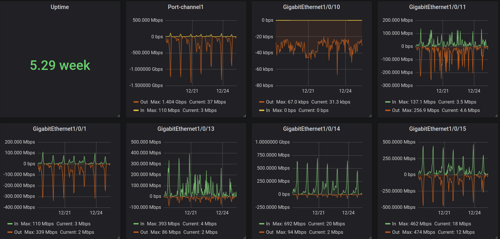

## Monitoring network via snmp

Để giám sát thiết bị mạng, chúng ta sử dụng giao thức snmp. Cách thức để prometheus thu thập thông tin như sau:

- Thiết bị mạng enable giao thức snmp và chỉ định một Client được phép get thông tin (qua port 161)

- Client (Trong trường hợp này snmp_exporter) sẽ thu thập thông tin của thiết bị mạng qua giao thức SNMP và expose mặc định các thông tin đó qua port 9116 với route metrics là /snmp

- Prometheus scrape thông tin mà snmp_exporter sẽ expose

Cấu hình để monitor thiết bị mạng như sau

## Trên thiết bị mạng

Trên thiết bị mạng, yêu cầu enable snmp

Tham khảo cách enable snmp tại: https://vnsys.wordpress.com/2018/07/28/su-dung-nagios-giam-sat-switch-router/

## Trên Prometheus

### Step1: Download và cài đặt snmp exporter

Download snmp exporter tại: https://github.com/prometheus/snmp_exporter/releases

```
cd /opt
wget https://github.com/prometheus/snmp_exporter/releases/download/v0.15.0/snmp_exporter-0.15.0.linux-amd64.tar.gz
tar zxvf snmp_exporter-0.15.0.linux-amd64.tar.gz
mv snmp_exporter-0.15.0.linux-amd64 snmp_exporter
```

### Step2: Run snmp_exporter as systemd

Tạo tệp tin /etc/systemd/system/snmp_exporter.service như sau

```
cat >/etc/systemd/system/snmp_exporter.service<<EOF
[Unit]
Description=Prometheus
Wants=network-online.target
After=network-online.target

[Service]
User=prometheus
Group=prometheus
Type=simple
ExecStart=/opt/snmp_exporter/snmp_exporter --config.file /opt/snmp_exporter/snmp.yml
[Install]
WantedBy=multi-user.target
EOF
```

Ở đây, snmp_exporter đọc tệp cấu hình snmp.yml mặc định chứa một số thông tin OIDs. Tùy thuộc vào yêu cầu chúng ta có thể bổ sung hoặc bỏ đi một số thông tin không cần lấy từ tệp snmp.yml. Chúng ta có thể sử dụng công cụ NetSNMP để phân tích MIBs và tạo tệp tin cấu hình snmp

Start snmp_exporter

```
systemctl daemon-reload
systemctl start snmp_exporter
systemctl enable snmp_exporter
```

### Step3: Cấu hình prometheus

Thêm nội dung sau vào tệp cấu hình /etc/prometheus/prometheus.yml để giám sát thiết bị mạng qua snmp

```
  - job_name: 'snmp'
    scrape_interval: 60s
    static_configs:
      - targets: ['192.168.1.254']
    metrics_path: /snmp
    params:
      module: [if_mib]
    relabel_configs:
      - source_labels: [__address__]
        target_label: __param_target
      - source_labels: [__param_target]
        target_label: instance
      - target_label: __address__
        replacement: 127.0.0.1:9116
```

Trong đó:

192.168.1.254 là địa chỉ IP của thiết bị mạng cần giám sát

127.0.0.1:9116 là địa chỉ snmp_exporter được cài đặt trên prometheus và expose với port 9116

Kiểm tra thông tin thu thập bằng curl

>[root@prometheus snmp_exporter]# curl  http://localhost:9116/snmp?target=192.168.1.254 |more
```
  % Total    % Received % Xferd  Average Speed   Time    Time     Time  Current
                                 Dload  Upload   Total   Spent    Left  Speed
  0     0    0     0    0     0      0      0 --:--:-- --:--:-- --:--:--     0# HELP ifAdminStatus The desired state of the interface - 1.3.6.1.2.1.2.2.1.7
# TYPE ifAdminStatus gauge
ifAdminStatus{ifAlias="",ifDescr="FastEthernet0",ifIndex="14002",ifName="Fa0"} 2
ifAdminStatus{ifAlias="",ifDescr="GigabitEthernet1/0/18",ifIndex="10118",ifName="Gi1/0/18"} 1
ifAdminStatus{ifAlias="",ifDescr="GigabitEthernet1/0/19",ifIndex="10119",ifName="Gi1/0/19"} 1
ifAdminStatus{ifAlias="",ifDescr="GigabitEthernet1/0/20",ifIndex="10120",ifName="Gi1/0/20"} 1
ifAdminStatus{ifAlias="",ifDescr="GigabitEthernet1/0/21",ifIndex="10121",ifName="Gi1/0/21"} 1
ifAdminStatus{ifAlias="",ifDescr="GigabitEthernet1/0/22",ifIndex="10122",ifName="Gi1/0/22"} 1
ifAdminStatus{ifAlias="",ifDescr="GigabitEthernet1/0/23",ifIndex="10123",ifName="Gi1/0/23"} 1
ifAdminStatus{ifAlias="",ifDescr="GigabitEthernet1/0/24",ifIndex="10124",ifName="Gi1/0/24"} 1
ifAdminStatus{ifAlias="",ifDescr="GigabitEthernet1/0/25",ifIndex="10125",ifName="Gi1/0/25"} 1
ifAdminStatus{ifAlias="",ifDescr="GigabitEthernet1/0/26",ifIndex="10126",ifName="Gi1/0/26"} 1
ifAdminStatus{ifAlias="",ifDescr="GigabitEthernet1/0/5",ifIndex="10105",ifName="Gi1/0/5"} 1
ifAdminStatus{ifAlias="",ifDescr="GigabitEthernet1/0/6",ifIndex="10106",ifName="Gi1/0/6"} 1
ifAdminStatus{ifAlias="",ifDescr="GigabitEthernet1/0/7",ifIndex="10107",ifName="Gi1/0/7"} 1
ifAdminStatus{ifAlias="",ifDescr="GigabitEthernet1/0/8",ifIndex="10108",ifName="Gi1/0/8"} 1
ifAdminStatus{ifAlias="",ifDescr="GigabitEthernet1/0/9",ifIndex="10109",ifName="Gi1/0/9"} 1
```

## Trên Grafana

Sử dụng dashboard SNMP Interface Throughput https://grafana.com/api/dashboards/1124/revisions/4/download

<p align="center">
