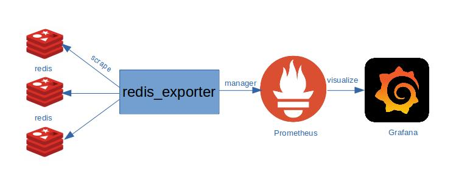

# Monitoring Redis Cluster

Tham khảo phần cấu hình redis_exporter cho nhiều redis instances tại:

[https://github.com/oliver006/redis_exporter#prometheus-configuration-to-scrape-multiple-redis-hosts](https://github.com/oliver006/redis_exporter#prometheus-configuration-to-scrape-multiple-redis-hosts)

<p align="center">

</p>

Chúng ta thực hiện cấu hình redis_exporter trên một server bất kỳ mà có thể được phép connect đến các redis instances và thực hiện scrape.

Ở đây tôi thực hiện cấu hình redis_exporter trên prometheus server

Mô hình thực hiện thực hiện như sau:

Redis_exporter: 192.168.1.111

Redis instances: 192.168.1.112:30001,192.168.1.112:30002,192.168.1.113:30001,192.168.1.113:30002,192.168.1.114:30001,192.168.1.114:30002

## Cấu hình Redis exporter

Cấu hình redis_exporter trên prometheus (192.168.1.111)

### Step1: Download và cài đặt redis exporter

```
cd /opt
wget https://github.com/oliver006/redis_exporter/releases/download/v1.5.0/redis_exporter-v1.5.0.linux-amd64.tar.gz
tar zxvf redis_exporter-v1.5.0.linux-amd64.tar.gz
mv redis_exporter-v1.5.0.linux-amd64/redis_exporter /usr/bin/
```

### Step2: Chạy redis exporter như dịch vụ systemd

- Tạo user chạy redis exporter

`useradd -rs /bin/false prometheus`

- Tạo tệp tin /etc/systemd/system/redis_exporter.service

```
cat >/etc/systemd/system/redis_exporter.service<<EOF
[Unit]
Description=Redis Exporter
Documentation=https://github.com/oliver006/redis_exporter
Wants=network-online.target
After=network-online.target

[Service]
Type=simple
User=prometheus
Group=prometheus
ExecReload=/bin/kill -HUP \$MAINPID
ExecStart=/usr/bin/redis_exporter \
  --log-format=txt \
  --namespace=redis \
  --web.listen-address=:9121 \
  --web.telemetry-path=/metrics \
  --redis.addr=

SyslogIdentifier=redis_exporter
Restart=always

[Install]
WantedBy=multi-user.target
EOF
```

**Chú ý**: Ở đây chúng ta thêm flag `--redis.addr=` với giá trị trống, để nó sẽ lấy một giá trị target khác mà chúng ta có thể chỉ định sau, thay vì lấy giá trị instance mặc định `localhost:6379`. Còn nếu muốn chỉ định một redis instance cụ thể, ví dụ `192.168.1.112:30001`, khi đó thêm  `--redis.addr=192.168.1.112:30001`

### Step3: Start redis exporter service

```
systemctl daemon-reload
systemctl start redis_exporter.service
systemctl enable redis_exporter.service
```

## Cấu hình trên Prometheus server

Thêm job cho redis_exporter và redis_exporter_targerts với nội dung sau được thêm vào tệp tin /etc/prometheus/prometheus.yml

```
  ## Redis Exporter
  - job_name: 'redis_exporter_targets'
    static_configs:
      - targets:
        - redis://192.168.1.112:30001
        - redis://192.168.1.112:30002
        - redis://192.168.1.113:30001
        - redis://192.168.1.113:30002
        - redis://192.168.1.114:30001
        - redis://192.168.1.114:30002
    metrics_path: /metrics
    relabel_configs:
      - source_labels: [__address__]
        target_label: __param_target
      - source_labels: [__param_target]
        target_label: instance
      - target_label: __address__
        replacement: 192.168.1.111:9121
  - job_name: redis_exporter
    static_configs:
      - targets: ['192.168.1.111:9121']
```
Trong đó:

job redis_exporter_targets, chúng ta sẽ thêm các redis instances sẽ được scrape bởi redis_exporter. Với 192.168.1.111:9121 là thông tin của redis_exporter
job redis_exporter, chúng ta khai báo thông tin của redis_exporter sẽ scrape các redis instances

check cấu hình prometheus

```
promtool check config /etc/prometheus/prometheus.yml 
Checking /etc/prometheus/prometheus.yml
  SUCCESS: 8 rule files found
```

Cuối cùng, thực hiện restart prometheus

`systemctl restart prometheus`

Kiểm tra thông tin các metrics được thu thập

```
curl http://192.168.1.111:9121/metrics?target=redis://192.168.1.112:30001
# HELP redis_allocator_active_bytes allocator_active_bytes metric
# TYPE redis_allocator_active_bytes gauge
redis_allocator_active_bytes 7.279120384e+09
# HELP redis_allocator_allocated_bytes allocator_allocated_bytes metric
# TYPE redis_allocator_allocated_bytes gauge
redis_allocator_allocated_bytes 6.810155368e+09
# HELP redis_allocator_resident_bytes allocator_resident_bytes metric
# TYPE redis_allocator_resident_bytes gauge
redis_allocator_resident_bytes 7.376330752e+09
# HELP redis_aof_current_rewrite_duration_sec aof_current_rewrite_duration_sec metric
# TYPE redis_aof_current_rewrite_duration_sec gauge
redis_aof_current_rewrite_duration_sec -1
# HELP redis_aof_enabled aof_enabled metric
# TYPE redis_aof_enabled gauge
redis_aof_enabled 0
# HELP redis_aof_last_bgrewrite_status aof_last_bgrewrite_status metric
# TYPE redis_aof_last_bgrewrite_status gauge
redis_aof_last_bgrewrite_status 1
# HELP redis_aof_last_cow_size_bytes aof_last_cow_size_bytes metric
# TYPE redis_aof_last_cow_size_bytes gauge
redis_aof_last_cow_size_bytes 0
# HELP redis_aof_last_rewrite_duration_sec aof_last_rewrite_duration_sec metric
# TYPE redis_aof_last_rewrite_duration_sec gauge
redis_aof_last_rewrite_duration_sec -1
# HELP redis_aof_last_write_status aof_last_write_status metric
# TYPE redis_aof_last_write_status gauge
redis_aof_last_write_status 1
# HELP redis_aof_rewrite_in_progress aof_rewrite_in_progress metric
# TYPE redis_aof_rewrite_in_progress gauge
redis_aof_rewrite_in_progress 0
# HELP redis_aof_rewrite_scheduled aof_rewrite_scheduled metric
# TYPE redis_aof_rewrite_scheduled gauge
redis_aof_rewrite_scheduled 0
# HELP redis_blocked_clients blocked_clients metric
# TYPE redis_blocked_clients gauge
redis_blocked_clients 3
# HELP redis_client_recent_max_input_buffer_bytes client_recent_max_input_buffer_bytes metric
# TYPE redis_client_recent_max_input_buffer_bytes gauge
redis_client_recent_max_input_buffer_bytes 2
# HELP redis_client_recent_max_output_buffer_bytes client_recent_max_output_buffer_bytes metric
# TYPE redis_client_recent_max_output_buffer_bytes gauge
redis_client_recent_max_output_buffer_bytes 0
# HELP redis_cluster_current_epoch cluster_current_epoch metric
# TYPE redis_cluster_current_epoch gauge
redis_cluster_current_epoch 8
# HELP redis_cluster_enabled cluster_enabled metric
# TYPE redis_cluster_enabled gauge
redis_cluster_enabled 1
...
```