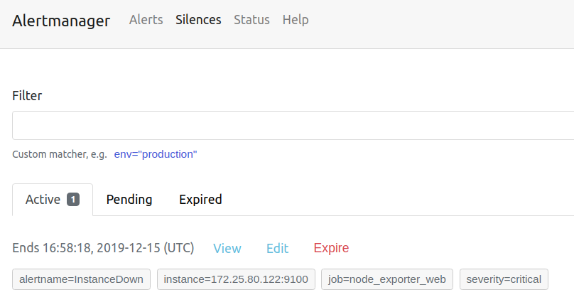
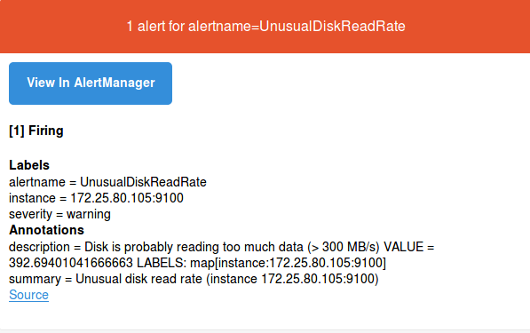
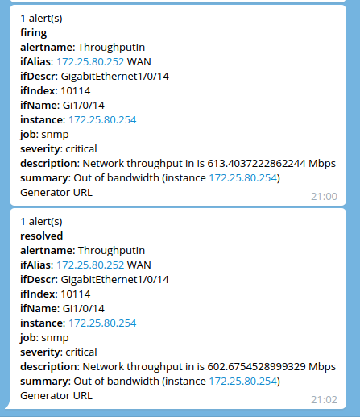

# Gửi cảnh báo qua telegram, email

Yêu cầu:

- Tài khoản email về mail server, authentication

- Kênh telegram với các thông tin về tokens của bot và thông tin chat_id của tài khoản telegram

Sử dụng chương trình sau để gửi cảnh báo qua kênh telegram [alertmanager-telegram-bot](https://hub.docker.com/r/ixdotai/alertmanager-telegram-bot)

## Bước 1: Run container cho telegram_bot

```
docker run -d -it \
    -p 9999:9999 \
    -e TELEGRAM_TOKEN="your token" \
    -e TELEGRAM_CHAT_ID="your chat id" \
    -e PORT=9999 \
    -e GELF_HOST=graylog \
    --name alertmanager-telegram-bot \
    ixdotai/alertmanager-telegram-bot:latest
```

Thay giá trị token của telegram_bot và chat_id cần nhận cảnh báo

## Bước 2: Cấu hình alertmanager

Chúng ta thiết lập cấu hình với 02 mức cảnh báo: warning và critical

- Với cảnh báo warning, thông báo sẽ được gửi qua email và gửi lại cảnh báo mỗi 60 phút (60m)

- Với cảnh báo ở mức critical, thông báo ngay lập tức được gửi đi qua kênh telegram và gửi lại cảnh báo mỗi 2m.

Ngoài ra, chúng ta thiết lập thêm rule “inhibition” để bỏ qua thông báo warning khi cảnh báo ở mức critical đã thực hiện nếu cùng cảnh báo. 

Tạo tệp cấu hình /etc/alertmanager/alertmanager.yml với nội dung sau:

```
global:
  resolve_timeout: 5m
  smtp_from: info@example.com
  smtp_smarthost: '192.168.1.120:25'
  smtp_auth_username: 'info@example.com'
  smtp_auth_password: 'Password'
  smtp_require_tls: false
templates:
- '/etc/alertmanager/templates/*.*'
route:
  group_wait: 30s
  group_interval: 30s
  repeat_interval: 60m
  #group_by: [infa, system]
  receiver: 'email'
  routes:
  - receiver: 'telegram-webhook'
    repeat_interval: 2m
    match:
        severity: critical
receivers:
  - name: 'telegram-webhook'
    webhook_configs:
      - url: http://localhost:9999/alert
  - name: 'email'
    email_configs:
    - to: 'keepwalking86@example.com'
inhibit_rules:
- source_match:
    severity: 'critical'
  target_match:
    severity: 'warning'
  # Apply inhibition if the alertname is the same.
  equal: ['alertname']
```
**Note**: ở đây, tôi sử dụng thông tin cấu hình email nội bộ công ty, không sử dụng chúng với TLS, vì vậy thêm tùy chọn  smtp_require_tls: false  (Mặc định thì smtp_require_tls: true)

## Bước 3: Cấu hình rule cảnh báo

Thiết lập các rule cảnh báo được thực hiện ở phía prometheus

Chúng ta có thể thực hiện tạo các rules vào cùng một tệp tin hoặc tách ra thành nhiều tệp tin chứa các rules.

- Tạo tệp tin /etc/prometheus/rules/redis.yml cho các rules liên quan redis cluster

```
groups:
- name: Redis cluster
  rules:
  - alert: OutOfMemory_warning
    expr: redis_memory_used_bytes/redis_memory_max_bytes *100 > 40
    for: 60s
    labels:
      severity: warning
    annotations:
      summary: "Out of memory (instance {{ $labels.instance }})"
      description: "Redis is running out of memory (> 40%)\n  VALUE = {{ $value }}\n  LABELS: {{ $labels }}"
  - alert: OutOfMemory_Critical
    expr: redis_memory_used_bytes/redis_memory_max_bytes *100 > 80
    for: 60s
    labels:
      severity: critical
    annotations:
      summary: "Out of memory (instance {{ $labels.instance }})"
      description: "Redis is running out of memory (> 80%)\n  VALUE = {{ $value }}\n  LABELS: {{ $labels }}"
```

## Bước 4: Cấu hình prometheus

Chỉ định vị trí các tệp cấu hình chứa các rules qua trường rule_files , cùng với thông tin kết nối với AlertManager vào tệp cấu hình /etc/prometheus/prometheus.yml với nội dung như sau

```
global:
  scrape_interval: 15s
rule_files:
  - ./rules/*.yml
alerting:
  alertmanagers:
  - static_configs:
    - targets:
      - localhost:9093
...
```
## Bước 5: Quản lý cảnh báo

Truy cập URL của AlertManager để kiểm tra quản lý cảnh báo http://your-prometheus-server:9093

<p align="center">

</p>

Với một số cảnh báo không cần thiết, không thừa nhận vấn đề nhưng không xử lý, chúng ta có thể thiết lập cảnh báo đó ở chế độ silence

Hình dưới thiết lập silence một cảnh báo với name là “InstanceDown” có instance=172.25.80.122:9100

<p align="center">

</p>

## Bước 6: Kiểm tra cảnh báo

Check email và thấy một số nội dung cảnh báo với mức **warning** được gửi về như sau

<p align="center">

</p>

Một số nội dung cảnh báo ở mức “critical” được gửi về kênh telegram với nội dung như sau:

<p align="center">

</p>